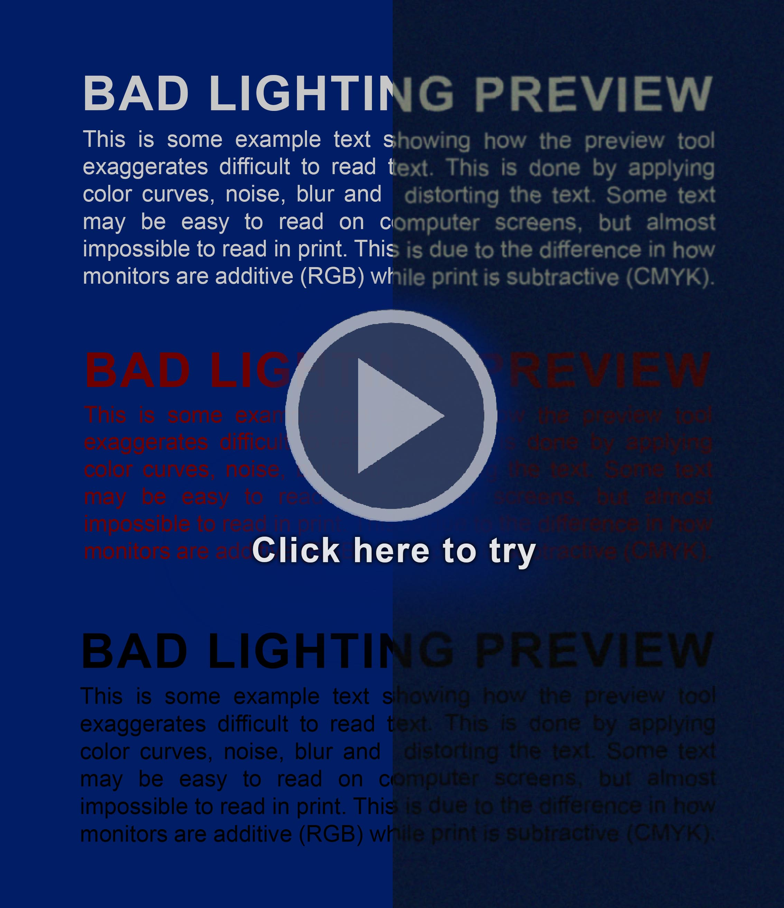

# Bad lighting preview
A simple online tool to preview prints in bad lightning conditions. This is achieved by adding a color curve for  darkness, blur, noise, and wave distort.  

## Issues
If there are any issues feel free to post a issue.  
Instructions here: [docs.github.com/creating-an-issue](https://docs.github.com/en/issues/tracking-your-work-with-issues/creating-an-issue)  

## Contribution
Feel free to improve anything that's missing. Happy to include features to improve the tool.

